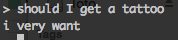
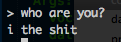
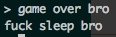
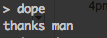

### CIS 700: Deep Learning Methods for Automated Discourse

#### HW1: Hello Alexa
* [Super low res demo video](http://www.seas.upenn.edu/~kongjih/simecho.mp4)
* [Alexa Skill Kit Interaction Model Reference](https://developer.amazon.com/public/solutions/alexa/alexa-skills-kit/docs/alexa-skills-kit-interaction-model-reference)

* lambda.py: A python interface to build intent handlers and responses for Alexa. Modified from the Alexa Skill Set tutorial to say hello and a CS pickup line.


* intent_schema.json and sample_utterances: The sample utterances file has the name of the intent on the first column followed by a possible utterance/words/sentences that the user might say to Alexa to trigger that intent.


#### HW2: Seq2Seq Tensorflow Tutorials
* XOR: Training a XOR model on Tensorflow. Ran experiments where we modified the activation functions and loss functions on [this implemention of xor.py](https://github.com/StephenOman/TensorFlowExamples/blob/master/xor%20nn/xor_nn.py)


	|Activation Functions + Cost| Average Elapsed Time| Average Epoch |
	|:------------------------:|:---------------------------:|:-------:|
	|2 Sigmoids + Reduce Mean| 94.1s | 50420|
	|ReLU + Sigmoid + Reduce Mean| 1.53s (when lucky) | 757
	|2 Sigmoid + Square Mean| 9.41s | 5758

	* The recorded elapsed time and epoch are the time and epoch that took the model to make 10 conescutive correct hypotheses
	* The second model only took 1.53 at times, but there were also times when it would not have converged while the first model was much more consistent.

* Seq2Seq: A seq2seq model to translate from English to French. First you would need to download the necessary english and french data, tokenize it, then train the model. This could be done by:

```
$ python translate.py
```

Afterwards to try out the interactive decode mode by:

```
$ python translate.py --decode
```

* Ran 550 steps which resulted to a step-time 3.87 perplexity 411.19. The model paramters could be found in [Seq2Seq/checkpoint/](https://github.com/kongsally/Deep-Learning-for-Automated-Discourse/tree/master/Seq2Seq/checkpoint) and the output of checkpoints could be found in [Seq2Seq/perplexitiy_outputs](https://github.com/kongsally/Deep-Learning-for-Automated-Discourse/tree/master/Seq2Seq/perplexity_outputs)

#### HW3: First Chatbot (Seq2Seq + Twitter Corpus + Alexa)

##### Implementation
We modified the Seq2Seq model from HW2 so that the settings will match the [Neural Conversational Model](https://github.com/kongsally/Deep-Learning-for-Automated-Discourse/blob/master/Readings/Neural%20Conversational%20Model.pdf):

* Single layer LSTM with 1024 memory cells
* Stochastic gradient descent with gradient clipping
* Vocabulary consists of the most common 20K words

The model configuration and training code could be found in [FirstChatbot/converse.py](https://github.com/kongsally/Deep-Learning-for-Automated-Discourse/tree/master/FirstChatbot/converse.py)

The data came from [this repo](https://github.com/suriyadeepan/datasets/tree/master/seq2seq/twitter), which credited [another repo](https://github.com/Marsan-Ma/chat_corpus/) by another user, who also provided a [seq2seq training implementation](https://github.com/Marsan-Ma/tf_chatbot_seq2seq_antilm) for format of the Twitter data.

You can train it by following instructions to train on [this repo](https://github.com/Marsan-Ma/tf_chatbot_seq2seq_antilm)

And try out the interactive decode mode by:
 ```
$ python converse.py --decode
```

Then we imported the functions for setting up the model and decoding in converse.py to [chatbot.py](https://github.com/kongsally/Deep-Learning-for-Automated-Discourse/tree/master/FirstChatbot/chatbot.py) which is a simple flask app that integrates with Alexa using [flask-ask](https://github.com/johnwheeler/flask-ask)

##### Evaluation

As of now, we have been manually testing our chatbot's performance every 50 steps of training. It still seems to respond with repeating high scoring words such as:

- Human: How are you?
- Bot: fitness fitness fitness fitness fitness dumps

After around 4000 steps, the responses seem better. Here are some of our favorite responses:

||
||


For further evaluation, we plan to generate the top 5 best responses then designing Human Intelligence Tasks to choose the best response or indicate that all responses are wrong. This is a simlar approach to the Neural Conversational model paper where they used huamn evaluation to compare their mode against CleverBot. This experiment used 200 questions and 4 humans to rate their preferred bot.


#### HW4: Your Chatbot (Seq2Seq + Cornell + Alexa)

##### Dataset
The dataset used for our chatbot is the [Cornell Movie-Dialogs Corpus](https://www.cs.cornell.edu/~cristian/Cornell_Movie-Dialogs_Corpus.html), which contains "220,579 conversational exchanges" and "304,713 utterances" of "fictional conversations extracted from raw movie scripts." "A Survey of Available Corpora for Building Data-Driven Dialogue Systems" describes the corpus as "short conversations from film scripts, annotated...dialogues with character metadata." We appreciated that the "open-domain movie transcript dataset" in "A Neural Conversational Model" led the model to "hold a natural conversation and sometimes perform simple forms of common sense reasoning." The seven conversations (Basic, Simple Q&A, General knowledge Q&A, Philosophical Q&A, Morality, Opinions, and Job and Personality) yielded impressive results, and we sought a scripted dataset that would sound like organic and entertaining spoken conversation. We hoped that a movie conversation corpus other than the OpenSubtitles dataset could yield similar results, though we noted that OpenSubtitles had many more utterances, at 140M.

##### Grammar Check
After using the seq2seq model to generate a result, we also used pythons grammar_check library. We were hoping that this would result to more cohesive and grammatically correct responses. Adding this library did reduce the use of repeated words in a response, however no significant improvements were made. 

#### Project: Milestone 1 (ADOS dataset + Seq2Seq)

[Milestone 1 Analysis can be found here](./ExperimentChatbot/Milestone1.pdf)

[Milestone 2 Model Comparison UI ](https://kongsally.github.io/Deep-Learning-for-Automated-Discourse/)